---

# ☁️ Nimbo Theme Pack for VS Code

**Nimbo** is a thoughtfully designed family of minimal, modern, and borderless themes for Visual Studio Code. Inspired by cloud palettes, elegant hues, and the popular *Ayu Mirage theme*, each variant is crafted to provide a focused, distraction-free development experience.

---

## 🎨 Included Variants

| Theme Name              | Description |
|------------------------|-------------|
| **Nimbo Dark**         | Clean, minimal, and neutral – perfect for all-day coding. |
| **Nimbo Light**        | Soft and bright, for clarity and daylight coding. |
| **Nimbo Bordered**     | A subtle twist with elegant UI borders for classic separation. |
| **Nimbo Warm**         | Cozy, sunset-inspired tones with warm highlights. |
| **Nimbo Cold**         | Cool blues and cyan shades for a breezy, modern look. |
| **Nimbo Blue**         | Bold, high-contrast blue-inspired dark theme. |
| **Nimbo Modern**       | Ultra-dark, sleek look with vibrant accents. |
| **Nimbo Solarized Dark** | A faithful Solarized dark mode variant. |
| **Nimbo Solarized Light** | A refined Solarized light mode variant. |

---

## 📦 Installation

1. Launch **Visual Studio Code**.
2. Open the **Extensions View** with `Ctrl+Shift+X`.
3. Search for **Nimbo Theme**.
4. Click **Install**.
5. Press `Ctrl+K Ctrl+T` and select your favorite Nimbo variant.

---

## 🖼️ Theme Previews

Here’s how each Nimbo variant looks in code-only mode and with full VS Code UI:

### 🌑 Nimbo Dark
**Code View**
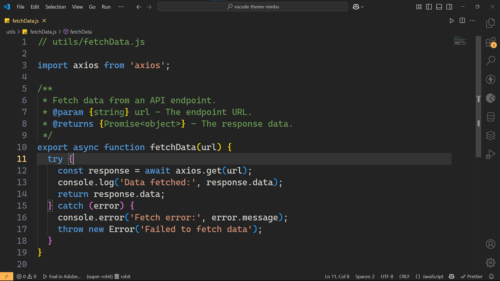

**Full UI**
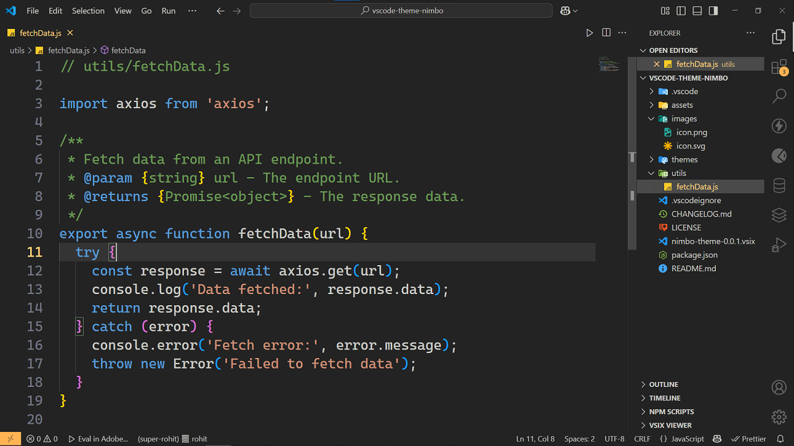

### 🧩 Nimbo Bordered
**Code View**
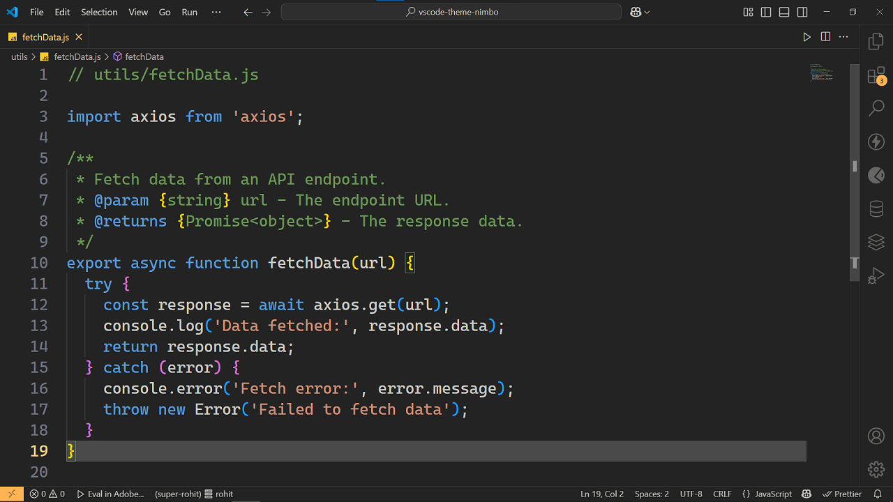

**Full UI**
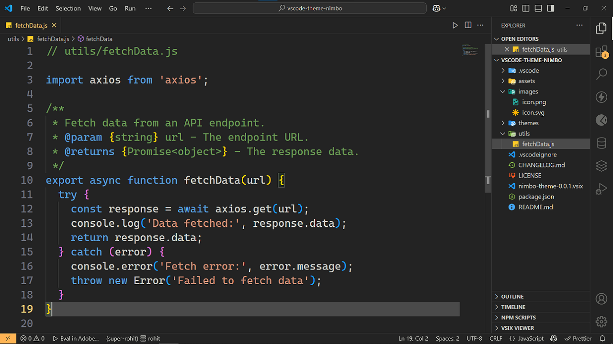

### 🕶️ Nimbo Modern
**Code View**
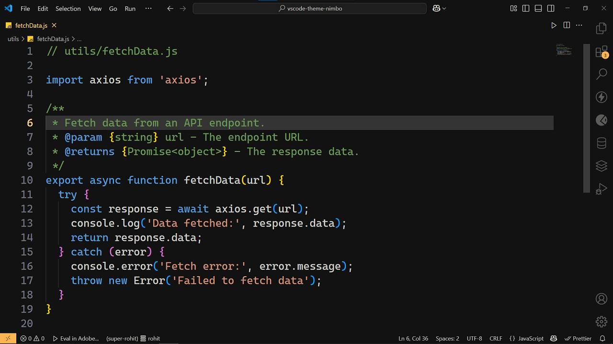

**Full UI**
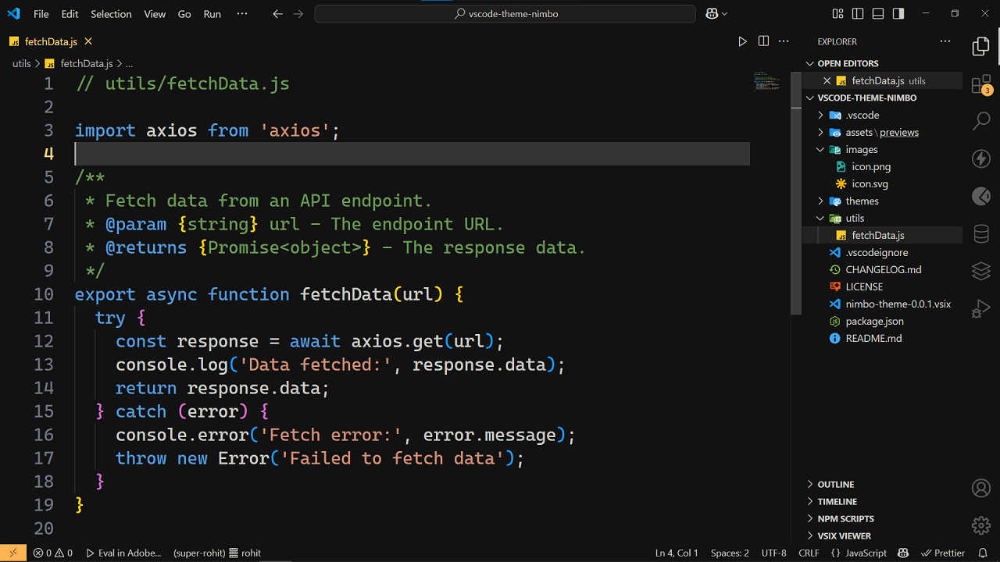

### 🔥 Nimbo Warm
**Code View**
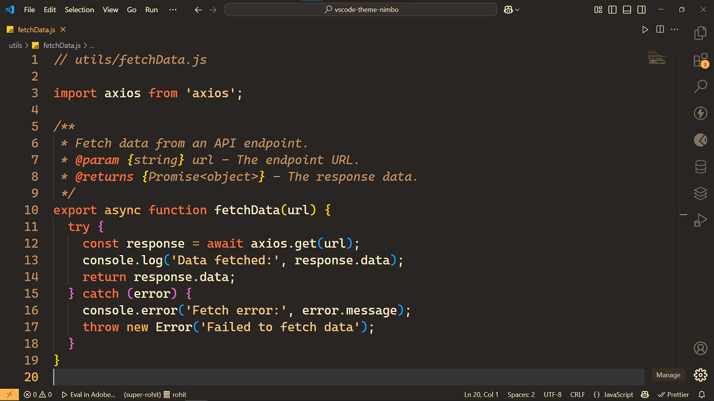

**Full UI**
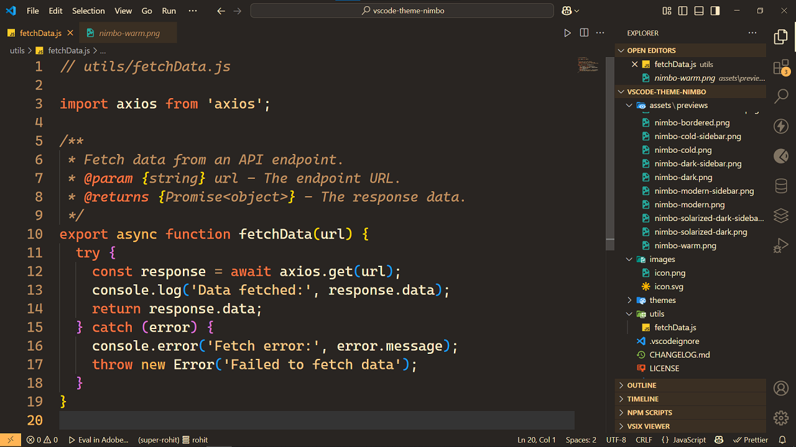

### ❄️ Nimbo Cold
**Code View**
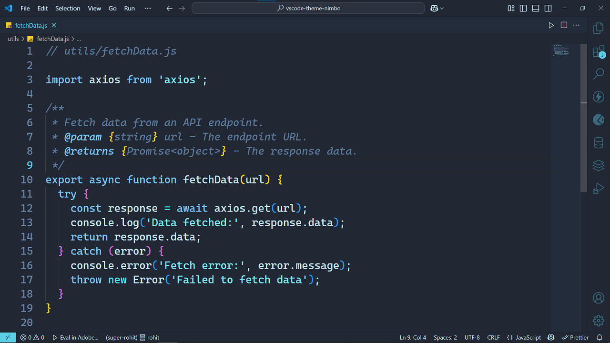

**Full UI**
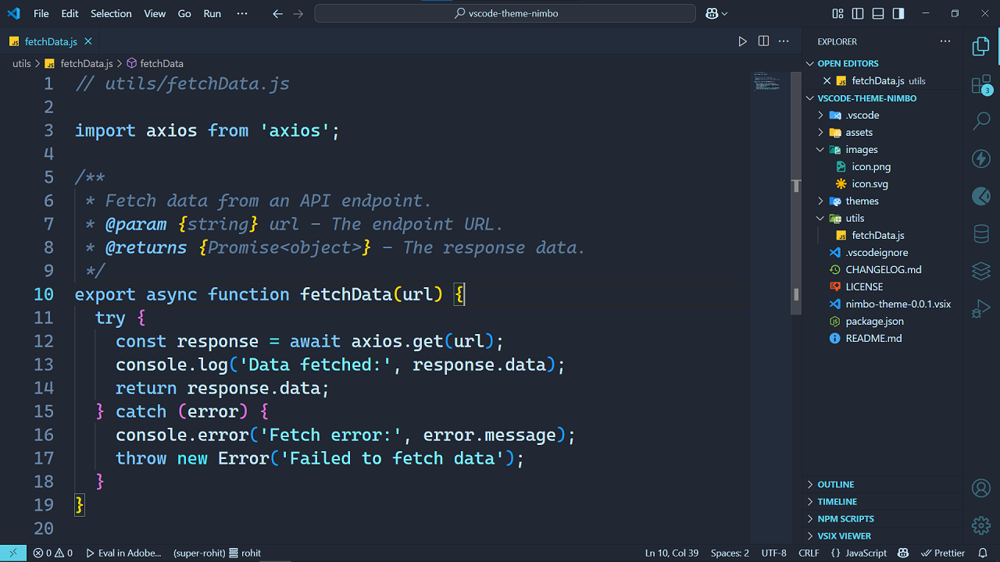

### 💙 Nimbo Blue
**Code View**

**Full UI**
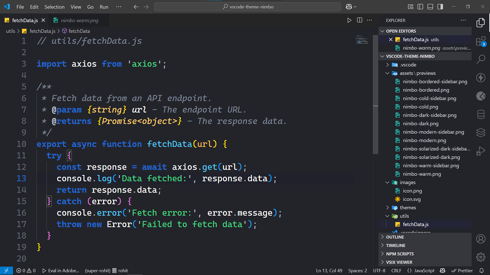

### 🌤 Nimbo Light
**Code View**
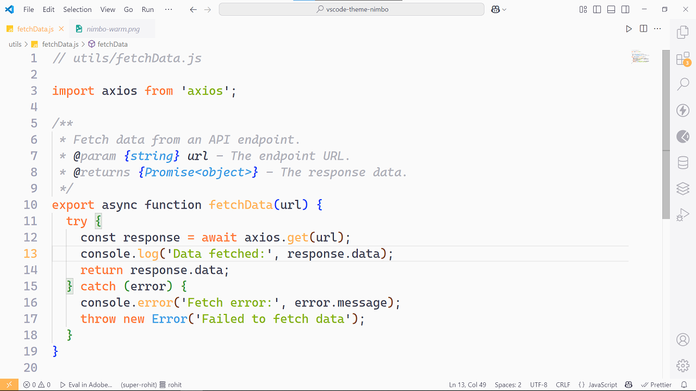

**Full UI**
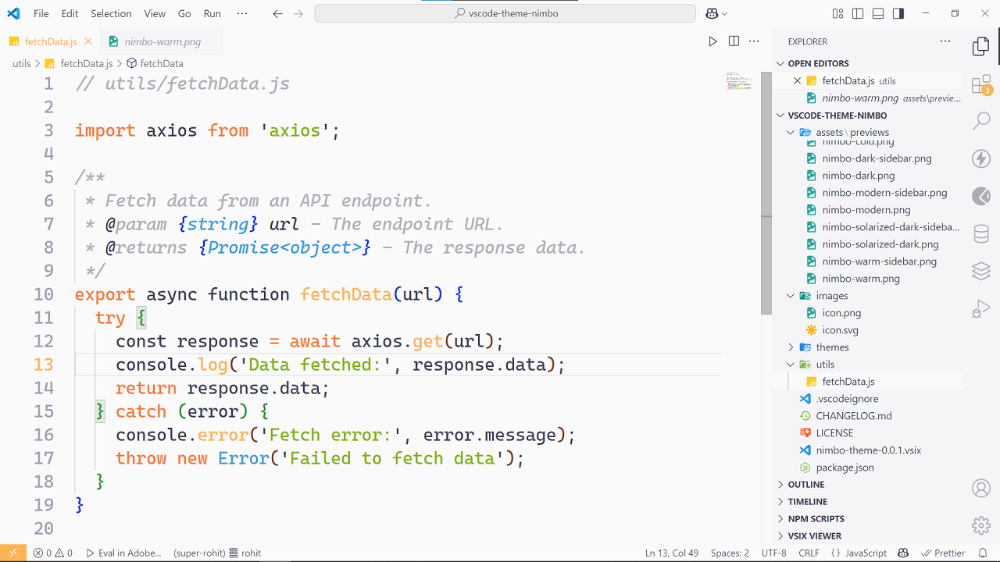

### 🌅 Nimbo Solarized Dark
**Code View**
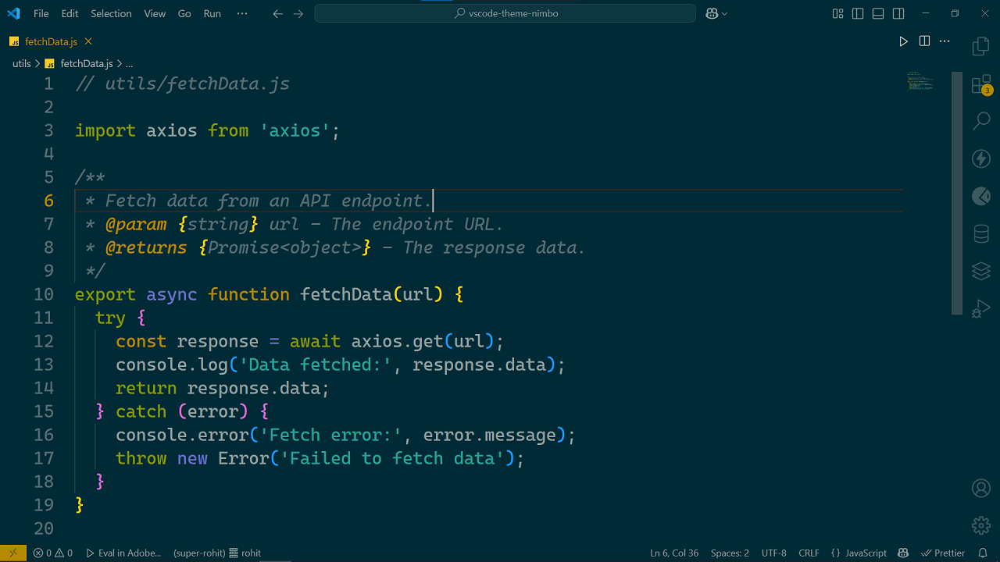

**Full UI**
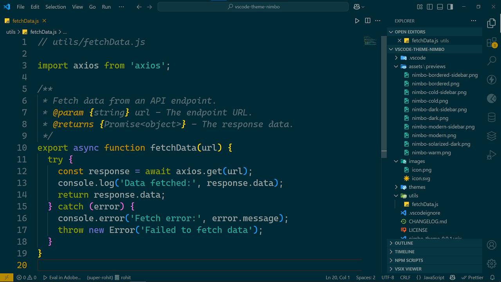

### 🌞 Nimbo Solarized Light
**Code View**
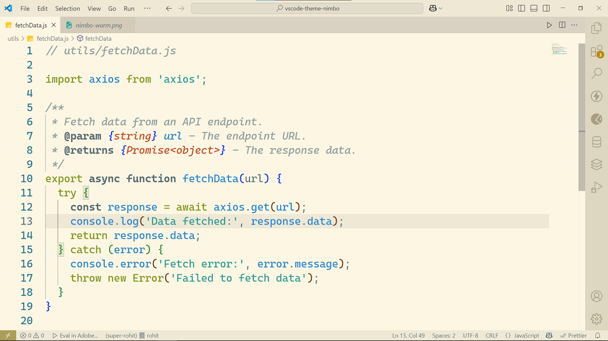

**Full UI**
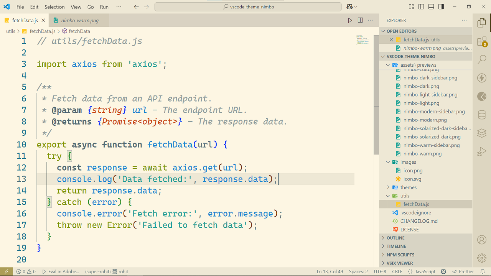

---

## 🤝 Contributing

Want to tweak a color, suggest a new variant, or improve accessibility?

- 💡 Open an issue for suggestions or bug reports.
- 👉 Submit a Pull Request with enhancements.
- 🧪 Help test themes across platforms and screen types.

We're happy to welcome new contributors! Let’s make Nimbo even better together.

> GitHub: [rohitramteke1/vscode-theme-nimbo](https://github.com/rohitramteke1/vscode-theme-nimbo)

---

## 📝 License

**MIT License**  
Made with ☁️ by [Rohit Ramteke](https://github.com/rohitramteke1)

---

## 🧭 Variants Overview

| Variant | Background | Accent | Notes |
|--------|------------|--------|-------|
| **Dark** | `#232323` | Amber (`#FFD580`) | Borderless |
| **Light** | `#FAFAFA` | Amber (`#FFB454`) | Subtle and modern |
| **Bordered** | `#232323` | Yellow (`#FFD580`) | Soft borders |
| **Warm** | `#292522` | Sunset amber/orange | Cozy tones |
| **Cold** | `#212733` | Cyan/sky-blue | Arctic coding |
| **Blue** | `#23242A` | Bold blue (`#2267D0`) | High contrast |
| **Modern** | `#121212` | Pale yellow | Super dark UI |
| **Solarized Dark** | `#002b36` | Solar Gold | Classic |
| **Solarized Light** | `#FDF6E3` | Earthy pastels | Balanced brightness |

---

📌 _Tested and refined on macOS, Windows, and Linux. Works great with popular extensions and fonts like Fira Code, JetBrains Mono, and Operator Mono._
# vscode-theme-nimbo
